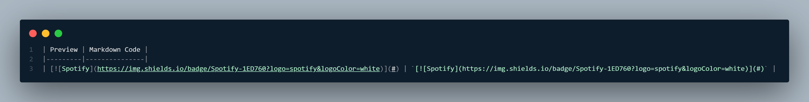

# Contributing to md-badges 

Thank you for considering contributing to this project! Your input is valuable, whether you're reporting bugs, suggesting additions, or giving your ideas.

However, before you do, **please** read below!

# Ways to Contribute 

### Reporting an issue/inconsistency: 

If you encounter anything that doesn't seem right, or that is wrong, please [open an issue](https://github.com/inttter/issues) and select the **"Issue Report"** template.

### Adding a badge:

If you'd like to request a badge, please [open an issue](https://github.com/inttter/issues) with the **"Badge Request"** template, or if you'd like to add it yourself, [open a pull request](https://github.com/inttter/pulls) with the following:

* Preview of the badge
* Code implemented inside of your pull request

# Pull Request Guidelines

Please ensure that you:

* Check to see that your badge isn't a duplicate

* Add the badges into the correct category
    * If your badge doesn't fit any of the current categories, you can create a new one.
       
       * Make sure it is an appropriate name (ie. Games Consoles is allowed, Playstation Consoles isn't.)

* Check if your badges appear properly
    * If not, see the [troubleshooting documentation](https://docs.inttter.com/contribution/troubleshooting) for various fixes.

* Use the same format as the other badges:

# License 
By contributing, you agree that your contributions will be licensed under the MIT License, which you can view [here](LICENSE).
