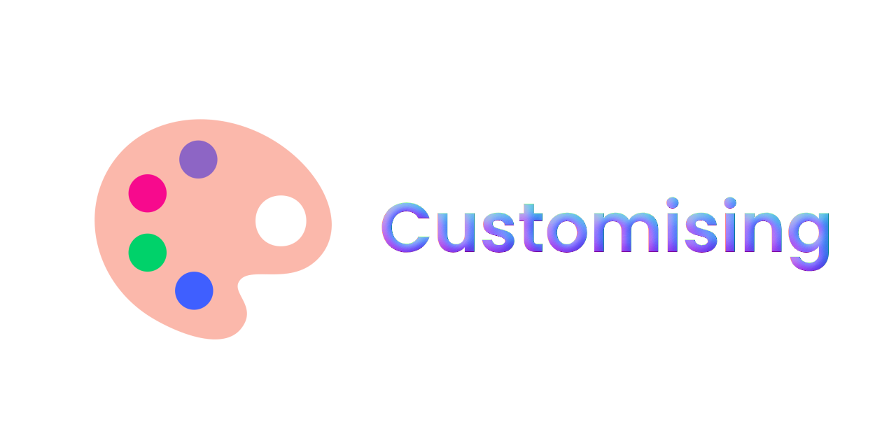

⚠️ Please note that all of these badges use `flat` style badges for their examples. 

Want to change the style of the button? Please see [Styles](STYLES.md) for documentation.

---

When using Shield.io badges in Markdown, you can modify various aspects such as badge color, text, logos, and styles.

### 1. Changing Badge Color

You can change the badge color by replacing `<color>` with your desired hexadecimal color code in the badge URL.

For Example: ``

Result: 

Replace `blue` with your desired color. 

### 1a. Using hexadecimal colors

Alternatively, you can use hexadecimal colors to get a specific shade of a color that shield.io may not have built in. 

For Example: ``

Result: 

---

### 2. Modifying Text

Change the text displayed on the badge by altering the text after the badge name in the URL (in this case, its **Some%20Placeholder%20Text**).

For Example: ``

Result: 

### 2a. Splitting text

Want to split the text to have 2 different sections? You can do this by adding a `-` between the words.

For Example: ``

Result: 

---
### 3. Adding Logos
Include logos on badges by specifying the logo name after the logo= parameter in the badge URL.

For Example (using the Docker logo): ``

Result: 

Another Example (using the Sass logo): ``

Result: 

### 3a. Supported icons/logos

Shield.io uses [Simple Icons](https://github.com/simple-icons/simple-icons) and a small sub-set of it's own icons/logos. If you can find your icon/logo on https://simpleicons.org, it will work with your badge. Shield.io also has its own few custom badges that you can find [here](https://github.com/badges/shields/tree/6e803367e0f3c8e0cc4196a700af37fac1629f4d/logo).