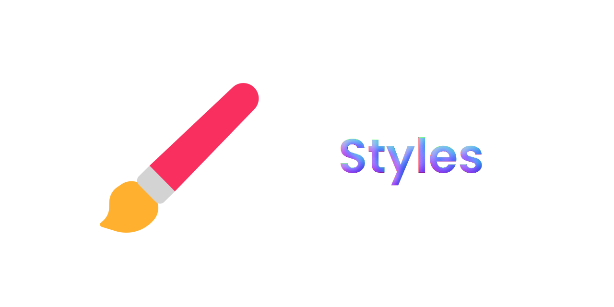

 

# ⛩️ Types of Badges ⛩️

[shield.io](https://github.com/badges/shields) has 5 different styles of buttons, including:

|| Types         | Styles                                                                                                    |
| :-: | :------------ | :-------------------------------------------------------------------------------------------------------- |
| 1   | Plastic       |                      |
| 2   | Flat-Square   |         |
| 3   | Flat          |                               |
| 4   | Social        |                         |
| 5   | For The Badge | -03650f?logo=github&style=for-the-badge) |

This project uses **Flat** badges for the sake of simplicity, similar to how [markdown-badges](https://github.com/Ileriayo/markdown-badges) uses **For The Badge** badges for theirs.

If you want to change the style of your badge, add the following code into your badge:

## **Plastic:**

`style=plastic`

**Example:** ``

**Result:** 

## **Flat Square:**

`style=flat-square`

**Example:** ``

**Result:**  

## **Flat:**

`style=flat`

**Example:** ``

**Result:**:

## Social

`style=social`

**Example:** ``

**Result:** 

## For The Badge

`style=for-the-badge`

**Example:** ``

**Result:** 

